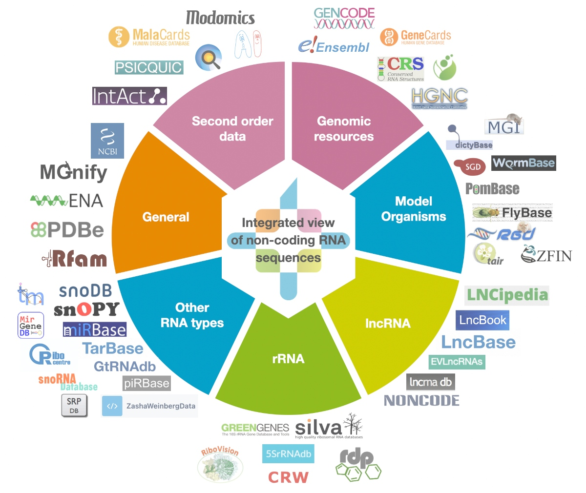

# RNAcentral Website

[](http://jenkins.rnacentral.org/job/rnacentral_testing/)

## About

[RNAcentral](https://rnacentral.org) is an open public resource that offers integrated access to a comprehensive and up-to-date set of non-coding RNA sequences provided by a consortium of Expert Databases.



The development of RNAcentral is coordinated by the
[European Bioinformatics Institute](https://www.ebi.ac.uk) and is funded by [Wellcome](https://wellcome.org).

## Installation

1. Clone Git repository:

  ```
  git clone --recursive https://github.com/RNAcentral/rnacentral-webcode.git
  ```

2. Using the `.env-example` file as a template, create the `.env` file and change the environment variables as desired. 
The [public postgres database](https://rnacentral.org/help/public-database) is configured by default.  
If you want to use another database, add the following environment variables: `DB_HOST`, `DB_NAME`, `DB_USER`, 
`DB_PASSWORD`, and `DB_PORT`.

3. Run the app using [Docker](https://www.docker.com):

  ```
  docker-compose -f docker-compose.local.yml up --build
  ```

## Feedback

Please get in touch if you have any feedback using [GitHub issues](https://github.com/RNAcentral/rnacentral-webcode/issues)
or using the [contact us form](https://rnacentral.org/contact).
